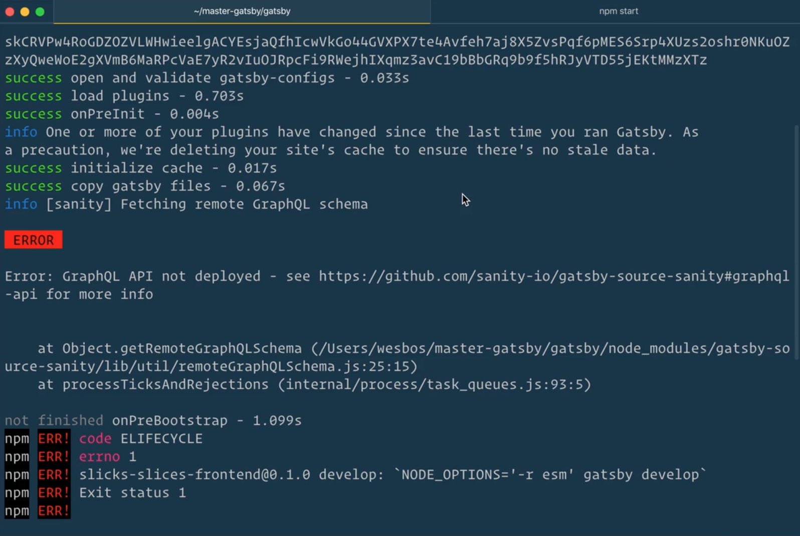
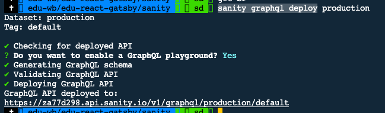

# React Gatsby

## Gatsby Config

### Plugins

install with npm

include in gatsby-config

include secrets ( like tokens ) in the an environment file ( .env )

```nodejs
import dotenv from 'dotenv';

dotenv.config({ path: '.env' });

export default {
  siteMetadata: {
    title: `Slicks Slices`,
    siteUrl: 'https://gatsby.pizza',
    description: 'The best pizza place in Hamilton!',
  },
  plugins: [
    'gatsby-plugin-styled-components',
    {
      // this is the name of the plugin you are adding
      resolve: 'gatsby-source-sanity',
      options: {
        projectId: 'YOU-NEED-TO-PUT-YOUR-OWN-PROJECT-ID-HERE',
        dataset: 'production',
        watchMode: true,
        token: process.env.SANITY_TOKEN,
      },
    },
  ],
};
```

### SANITY.IO

Plugin: 'gatsby-source-sanity' 

- install from npm
- include in gatsby-config.js in root of Gatsby project

Project ID: get from 'manage.sanity.io' dashboard for project

Token: get from 'manage.sanity.io' dashboard for project under

- settings
- tokens (secret so do not store in code or config files - use environment - .env - variables) - do not allow to be stored in GIT

#### Gotchas when working with Sanity and GraphQL

Error-Message: GraphQL API not deployed

Sanity by default has what is called a GROC API. If you want a GraphQL API (which is actually built with GROC) you need to deploy it by pressing on the link next to the error message in the terminal ( <https://www.sanity.io/docs/graphql> ).



(<https://www.sanity.io/docs/graphql#63c1424b5fc3>)

IMPORTANT: run the graphql deploy in SANITY terminal folder NOT in the GATSBY folder.

**Gotcha**
Keep in mind that changing the schema in your local Sanity studio does not automatically change the GraphQL API – you'll have to run sanity graphql deploy to make the API reflect the changes.

### Deploying the GraphQL API

<https://www.sanity.io/docs/graphql#04501f1778aa>
Run sanity graphql deploy from your Sanity Studio project folder. This will deploy an API for the dataset configured in sanity.json. If you want to deploy to a different dataset, use the --dataset flag, eg: sanity graphql deploy --dataset staging.

_> terminal
`sanity graphql deploy`

This gives you a link to the playground in the terminal output



Click this link to go to playground and you'll see your Schemas listed which you can then query against.

