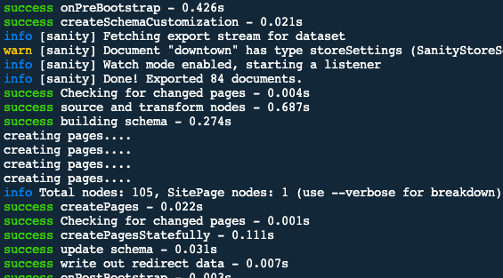
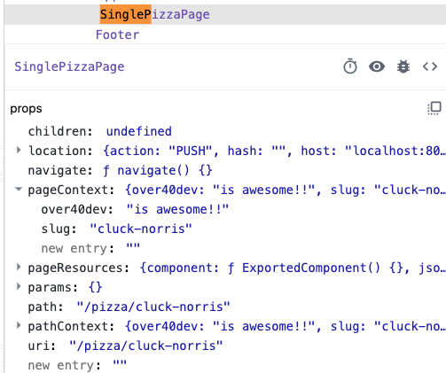
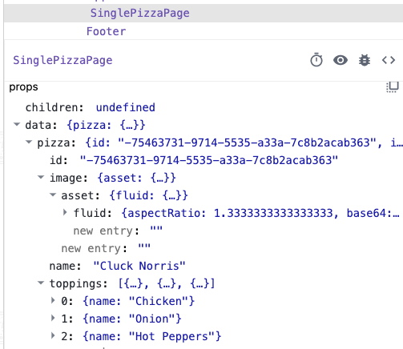

# React Gatsby

## Dynamically creating pages with gatsby-node

### Gatsby Node APIs

#### createPages Hook

<https://www.gatsbyjs.com/docs/reference/config-files/gatsby-node/>

Gatsby Node APIs allow us to hook into Gatsby and do things...

such as create pages.

We are using **createPages**

Create pages dynamically. This extension point is called only after the initial sourcing and transformation of nodes plus creation of the GraphQL schema are complete so you can query your data in order to create pages.

```javascript
export async function createPages() {
  console.log('creating pages....');
  console.log('creating pages....');
  console.log('creating pages....');
  console.log('creating pages....');
}
```

Note: we use an **async** function

**Console Output**:



#### createPages Hook (with Params)

```javascript
async function turnPizzasIntoPages(params) {
  // 1. Get a template for this page
  //  2. Query all pizzas
  //  3. Loop over each pizza and create a page for that pizza
}

export async function createPages(params) {
  // create pages dynamically
  // 1. Pizzas
  //  2. Toppings
  //  3. Slicemasters
}
```

#### Create Template (Pizza)

Notice that the file, we locate in a folder called **templates**, starts with a **capital letter**. While this is NOT required... templates are basically **classes** that will be instantiated many times and each **instance** of the **class** will start with a **lowercase letter**. So the casing is really just to signal to the developer the type of code being created much like React Component files start with **caps**.

#### createPages Hook ({graphql, actions})

**action.createPage**:

<https://www.gatsbyjs.com/docs/reference/config-files/actions/#createPage>

```javascript
import path from 'path';

async function turnPizzasIntoPages({ graphql, actions }) {
  // 1. Get a template for this page
  const pizzaTemplate = path.resolve(`./src/templates/Pizza.js`);
  //  2. Query all pizzas
  const { data } = await graphql(`
    query {
      pizzas: allSanityPizza {
        nodes {
          name
          slug {
            current
          }
        }
      }
    }
  `);
  // console.log(data);
  //  3. Loop over each pizza and create a page for that pizza
  // use forEach() because we are just looping... not returning anything
  data.pizzas.nodes.forEach((pizza) => {
    // console.log(`Creating page for ${p.name}`);
    // .createPage() is the actual method while createPages is the Hook into it
    actions.createPage({
      // What is the URL for this new page??
      path: `pizza/${pizza.slug.current}`,
      component: pizzaTemplate,
    });
  });
}

export async function createPages(params) {
  // create pages dynamically
  // 1. Pizzas
  // use await because we are calling async function
  await turnPizzasIntoPages(params);
  //  2. Toppings
  //  3. Slicemasters
}
```

#### Context

Use **React Context** to pass data:

**Correct**:         pageContext
**Deprecated**:   pathContext

```javascript
  data.pizzas.nodes.forEach((pizza) => {
    // console.log(`Creating page for ${p.name}`);
    // .createPage() is the actual method while createPages is the Hook into it
    actions.createPage({
      // What is the URL for this new page??
      path: `pizza/${pizza.slug.current}`,
      component: pizzaTemplate,
      context: {
        over40dev: 'is awesome!!',
        slug: pizza.slug.current,
      },
    });
  });
```

**React-Dev-Tools**:

Inspect | Search for SinglePizzaPage



#### Dynamic Query for SinglePizzaPage with GraphQL

using GraphiQL to get our basic GraphQL query figured out

```Graph-i-QL
query {
  sanityPizza(slug: {
    current: {
      eq: "nacho-average-pizza"
    }
  }) {
    name
    toppings {
      name
    }
  }
}
```

```javascript
import React from 'react';
import { graphql } from 'gatsby';

export default function SinglePizzaPage() {
  return <p>Single Pizza!!!</p>;
}

// this needs to be Dynamic  based on the slug passed in via context in gatsby-node.js
// This is a GraphQL Query which has access to all our contexts directly
// use Parens after QUERY to pass in Dynamic variables
// all Dynamic variables being accepted must be TYPED
// the BANG ( ` ! `) on the end means it's absolutely required... meaning you cannot view this page without passing it a slug
// $slug is passed in because we set a CONTEXT variable named SLUG when we call **actions.createPage** from **gatsby-node.js**
export const query = graphql`
  query($slug: String!) {
    pizza: sanityPizza(slug: { current: { eq: $slug } }) {
      name
      id
      image {
        asset {
          fluid(maxWidth: 800) {
            ...GatsbySanityImageFluid
          }
        }
      }
      toppings {
        name
      }
    }
  }
`;
```

**React-Dev-Tools Output**:



Q. Why not just pass the entire Pizza Object via Context and avoid the Query on the SinglePizzaPage?

A. That is perfectly valid... however... because all the SinglePizzaPages work the same... it is sometimes easier to have the Query directly in this code in case modifications or even just a quick check of something in the query is needed. Another benefit is that as soon as you make a change to the Query in SinglePizzaPage, it is automatically updated in the React-Dev-Tools. Another related advantage is that if you wrote your entire Query in Gatsby-Node you would have to kill the process each time you made a Query Update and that process can be slow as your website grows.
... again - not a hard and fast rule - personal preference
