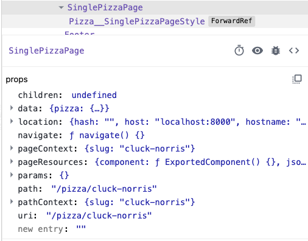

# React Gatsby

## Templating and Styling our Single Pizza Page

### Get Access to Data inside Component

Q. How do we get the data inside our component?

A. It is available to us as a prop called **data**

View this in React-Dev-Tools for SinglePizzaPage (The Component):



```javascript
export default function SinglePizzaPage({ data }) {
  console.log(data.pizza);
  return (
    <>
      <h2>Single Pizza</h2>
    </>
  );
}
```

### Adding Image inside Component in Gatsby

First, `import Img from 'gatsby-image';` (this one will not auto-import; the name is possibly different inside package?????)

Second, use the **Img** as a tag.

Thired, use **fluid prop** set equal to the **fluid property** which lives inside **image.asset.fluid** which in this case is inside the **pizza prop** Object.

```javascript
export default function SinglePizzaPage({ data: { pizza } }) {
  console.log(pizza);
  return (
    <>
      <h2>{pizza.name}</h2>
      
    </>
  );
}
```

### Styled Components - SinglePizzaPage - Grid

```javascript
import React from 'react';
import { graphql } from 'gatsby';
import styled from 'styled-components';
import Img from 'gatsby-image';

const PizzaGrid = styled.div`
  display: grid;
  gap: 2rem;
  grid-template-columns: repeat(auto-fill, minmax(400px, 1fr));
`;

export default function SinglePizzaPage({ data: { pizza } }) {
  console.log(pizza);
  return (
    <PizzaGrid>
      
      <div>
        <h2 className="mark">{pizza.name}</h2>
        <ul>
          {pizza.toppings.map((topping) => (
            <li key={topping.id}>{topping.name}</li>
          ))}
        </ul>
      </div>
    </PizzaGrid>
  );
}

// this needs to be Dynamic  based on the slug passed in via context in gatsby-node.js
// This is a GraphQL Query which has access to all our contexts directly
// use Parens after QUERY to pass in Dynamic variables
// all Dynamic variables being accepted must be TYPED
// the BANG ( ` ! `) on the end means it's absolutely required... meaning you cannot view this page without passing it a slug
// $slug is passed in because we set a CONTEXT variable named SLUG when we call **actions.createPage** from **gatsby-node.js**
export const query = graphql`
  query($slug: String!) {
    pizza: sanityPizza(slug: { current: { eq: $slug } }) {
      name
      id
      image {
        asset {
          fluid(maxWidth: 800) {
            ...GatsbySanityImageFluid
          }
        }
      }
      toppings {
        name
      }
    }
  }
`;
```
