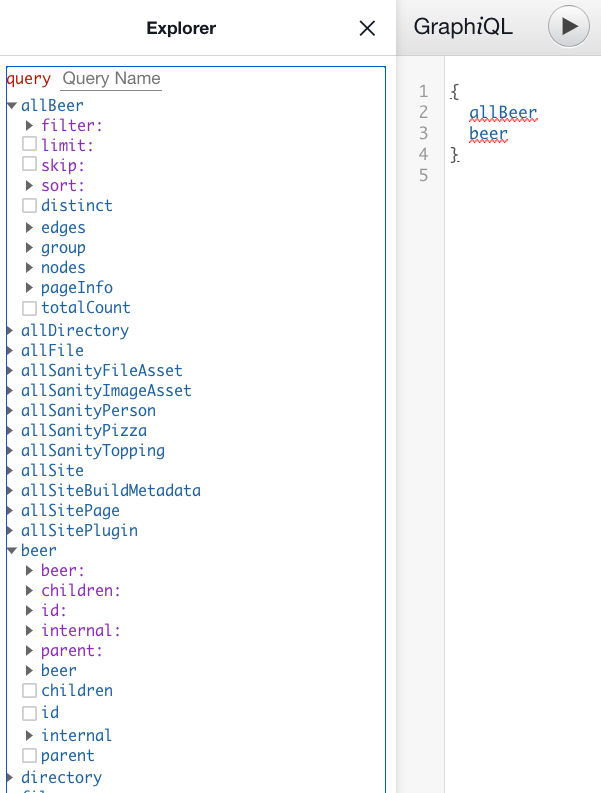

# React Gatsby

## Sourcing Data from an external API

### Fetch Data from External API (sample data)

We can source data from any available API. For dev and testing we can use a sample API such as the ones available from <https://sampleapis.com> 

### Where to put Fetch Code in Gatsby

Put the **Fetch Code** in the 'gatsby-node.js' file before we **createPage** using another **Gatsby Hook** called **sourceNodes**.

<https://www.gatsbyjs.com/docs/reference/config-files/gatsby-node/#sourceNodes>
Extension point to tell plugins to source nodes. This API is called during the Gatsby bootstrap sequence. Source plugins use this hook to create nodes. This API is called exactly once per plugin (and once for your site’s gatsby-config.js file). If you define this hook in gatsby-node.js it will be called exactly once after all of your source plugins have finished creating nodes.

Note: typically, in JavaScript we would use the **Fetch API** but that is a **browser API** and this is actually a **Node** file (likely coming to Node in the future). As of now, to use **Fetch** in **Node** file you must **import** a package ( `import fetch from 'isomorphic-fetch;` )

```javascript

```

Stop and Re-Start Gatsby.

Now, in the GraphQL endpoint (view in Graph-i-QL | graphiql). Gatsby will create two query entries for you:

- first, with the name you used... in our case 'Beer' (internal: {type: 'Beer'} in above code)
- second, with the prefix 'all' as in 'allBeer'




