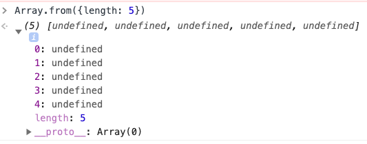

# React Gatsby

## 29-Paginating Data in Gatsby

Since Gatsby is **pre-built** we need to know how many pages we have at **build-time** instead of **run-time**

Put in **environment variable** in **.env** file. Variables could also be put in a JavaScript **settings** file if they do not contain secret info like tokens.

In order to surface a variable from **.env** inside Gatsby the variable must be prefixed in the file with **GATSBY_**

```bash
GATSBY_PAGE_SIZE=4
```

### Loop from 1 to n (slicemasters) and create pages

Create an **Array** of a **size** by using `Array.from()` and passing in an **Object** with a **length** property. This creates an array with length equal to the length property. For example: if we have a `{length: 5}` we get the following result.

```javascript
console.log(Array.from({ length: 5 }));
```



**Note**: the length value can come from anywhere (hard-coded, passed into function, set as variable, come from node environment variable, etc)

We can then loop over the **Array** we just created with `.forEach()`. Since the array has all elements set to **undefined** we can ignore it (often times devs use an `_` when ignoring a value). It is the **index** value that we are interested in. Therefore, the **arrow function** we pass to `.forEach()` contains `_` as a placeholder since the it is the second value passed that contains the **index** (the third and final value is the array itself which is usually not needed but is available just in case).

```javascript
console.log(
  Array.from({ length: 5 }).forEach((_, index) => {
    console.log(`Creating page ${index + 1}`);
  })
);
```


In our case (`pageCount`) is a variable we calculate based on the **pageSize** from **.env** file and the number of **slicemasters** (people):

```javascript
// Everything from .ENV, even numbers, come in as Strings so we need to convert to number
  const pageSize = parseInt(process.env.GATSBY_PAGE_SIZE);
  const pageCount = Math.ceil(data.slicemasters.totalCount / pageSize);
  // Loop from 1 to n and create the pages for them
  Array.from({ length: pageCount }).forEach((_, i) => {
    console.log(i + 1);
    actions.createPage({
      path: `/slicemasters/${i + 1}`,
      component: path.resolve(`./src/pages/slicemasters.js`),
      // This data is passed to the template when we create it
      context: {
        skip: i * pageSize,
        currentPage: i + 1,
        pageSize,
      },
    });
  });
```

Working on the **SliceMastersPage** ('slicemasters.js') in the **pages** folder, our code now looks like this:

```javascript
import path from 'path';
import fetch from 'isomorphic-fetch';

async function turnPizzasIntoPages({ graphql, actions }) {
  // 1. Get a template for this page
  const pizzaTemplate = path.resolve(`./src/templates/Pizza.js`);
  //  2. Query all pizzas
  const { data } = await graphql(`
    query {
      pizzas: allSanityPizza {
        nodes {
          name
          slug {
            current
          }
        }
      }
    }
  `);
  // console.log(data);
  //  3. Loop over each pizza and create a page for that pizza
  // use forEach() because we are just looping... not returning anything
  data.pizzas.nodes.forEach((pizza) => {
    // console.log(`Creating page for ${p.name}`);
    // .createPage() is the actual method while createPages is the Hook into it
    actions.createPage({
      // What is the URL for this new page??
      path: `pizza/${pizza.slug.current}`,
      component: pizzaTemplate,
      context: {
        slug: pizza.slug.current,
      },
    });
  });
}

async function turnToppingsIntoPages({ graphql, actions }) {
  // 1. Get the template
  const toppingsTemplate = path.resolve(`./src/pages/pizzas.js`);
  // 2. Query all the toppings
  const { data } = await graphql(`
    query {
      toppings: allSanityTopping {
        nodes {
          id
          name
        }
      }
    }
  `);

  // 3. createPage for that topping
  data.toppings.nodes.forEach((topping) => {
    actions.createPage({
      path: `topping/${topping.name}`,
      component: toppingsTemplate,
      context: {
        topping: topping.name,
        toppingRegex: `/${topping.name}/i`,
      },
    });
  });
  // 4. Pass topping data to Pizza.js
}

async function turnSlicemastersIntoPages({ graphql, actions }) {
  // 1. Query all slicemasters
  const { data } = await graphql(`
    query {
      slicemasters: allSanityPerson {
        totalCount
        nodes {
          name
          id
          slug {
            current
          }
        }
      }
    }
  `);
  // 2. TODO: Turn each slicemaster into their own page
  // 3. Figure out how many pages there are based on how many slicemasters there are, and how many per page
  // Everything from .ENV, even numbers, come in as Strings so we need to convert to number
  const pageSize = parseInt(process.env.GATSBY_PAGE_SIZE);
  const pageCount = Math.ceil(data.slicemasters.totalCount / pageSize);
  // 4. Loop from 1 to n and create the pages for them
  Array.from({ length: pageCount }).forEach((_, i) => {
    console.log(i + 1);
    actions.createPage({
      path: `/slicemasters/${i + 1}`,
      component: path.resolve(`./src/pages/slicemasters.js`),
      // This data is passed to the template when we create it
      context: {
        skip: i * pageSize,
        currentPage: i + 1,
        pageSize,
      },
    });
  });
}

async function fetchBeersAndTurnIntoNodes({
  actions,
  createNodeId,
  createContentDigest,
}) {
  // 1. Fetch list of beers
  const res = await fetch('https://api.sampleapis.com/beers/ale');
  const beers = await res.json();
  // 2. Loop over each beer (any loop such as forEach or...)
  for (const beer of beers) {
    const nodeMeta = {
      id: createNodeId(`beer-${beer.name}`),
      parent: null,
      children: [],
      internal: {
        type: 'Beer',
        mediaType: 'application/json',
        contentDigest: createContentDigest(beer),
      },
    };
    // 3. Create a Node for each beer
    // pass ONE object... spread values into it
    // refactor: should be spread as {...beer} not {beer}
    actions.createNode({ ...beer, ...nodeMeta });
  }
}

// Gatsby API Function (Hook) to Source External Data from API
// Docs: https://www.gatsbyjs.com/docs/reference/config-files/gatsby-node/#sourceNodes
export async function sourceNodes(params) {
  // fetch list of beers and source them into our Gatsby API
  await Promise.all([fetchBeersAndTurnIntoNodes(params)]);
}

// Gatsby API Function (Hook) to Create Pages
export async function createPages(params) {
  // create pages dynamically
  // Pizzas, Toppings and Slicemasters
  // Since both can be run **concurrently** and both are **JavaScript Promise-based** we can `await Promise.all([...])` and pass an array of **Promises**.
  // Wait for all promises to be resolved before finishing this function (i.e. go web page)
  await Promise.all([
    turnPizzasIntoPages(params),
    turnToppingsIntoPages(params),
    turnSlicemastersIntoPages(params),
  ]);
}
```
