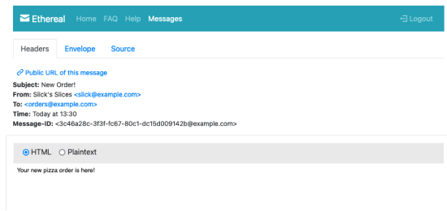

# React Gatsby

## Serverless Functions

Serverless functions run in a Node process. The difference with serverless functions is that they do one thing and when that is done the process stops.

A normal server keeps running and can do lots of stuff.

You can use serverless functions with any framework, you just need a URL to ping. We are using Netlify which hosts serverless functions. (most platforms do)

It's just Node code that can be deployed anywhere.

### Serverless Functions on Netlify

In the root of your application add a **netlify.toml**. This file tells the Netlify build where to find the functions.

```bash
[build]
  functions = "functions/"
```

They are **AWS Lamdas** under the hood so you can always go to the Amazon AWS Lamda docs if you need more information.

### Setup 'functions' folder in Root

This is where we place our serverless functions.

For each function you need to create a folder and inside that folder create a JavaScript file with the exact same name.

### Hello Example of Serverless Functions

Create new folder in functions folder called 'hello'.

Create a file in the 'hello' folder called 'hello.js'.

For the serverless function, setup an **async handler**.

```javascript
exports.handler = async (event, context) => {
  console.log(event);
  return {
    statusCode: 200,
    body: 'Hello!!',
  };
};
```

In order to visit this URL ('hello.js') you need to go to:

http://localhost:8888/.netlify/functions/hello

### Serverless Functions and NPM Packages

This is just Node code so you can **npm install** or require any packages to build your function.

You can also have your own 'package.json' file inside each function's folder.

### Serverless Function - PlaceOrder

In terminal, go to 'gatsby/functions/placeOrder' folder and run **npm init** which will create a new 'package.json' file in this folder. The '-y' just means to create using the defaults otherwise you have to press enter through the setup questions.

```bash
npm init -y
```

Still in this folder we install the package we need which in this case is for email called **nodemailer**

```bash
npm i nodemailer
```

### Sending Email from Serverless Function

Normally you have to have an account with a **transactional email service** such as **postmark** or **sendgrid** but for testing with **nodemailer** you can use **https://ethereal.email** (setup by the folks behind nodemailer for testing).

### Ethereal Email Testing for Nodemailer

Fake email account.

No difference in code when using a transactional email service... just swap out the credentials.

Create an account and you get a page with a fake name, username and password as well as the configuration to setup this up in nodemailer.

### Setup Configuration Info in .env File

Put the account and emailer info into an environment variable in **.env** file.

```bash
MAIL_HOST="smtp.ethereal.email"
MAIL_USER="bobbie3@ethereal.email"
MAIL_PASS="hhXtSXWAjRk7Tz85UN"
```

### Serverless Function - PlaceOrder Code

Note: when testing email - ALWAYS use **example.com** because that is set aside for testing... otherwise someone might own the domain and get your test email which could accidentally contain sensitive info.

Note: for now, must use **CommonJS** syntax not **ES Import** syntax.

For the serverless function, setup an **async handler** that has **event** and **context** as parameters.

```javascript
const nodemailer = require('nodemailer');

// create transport for nodemailer
const transporter = nodemailer.createTransport({
  host: process.env.MAIL_HOST,
  port: 587,
  auth: {
    user: process.env.MAIL_USER,
    pass: process.env.MAIL_PASS,
  },
});

exports.handler = async (event, context) => {
  // Test send an email
  const info = await transporter.sendMail({
    from: "Slick's Slices <slick@example.com>",
    to: 'orders@example.com',
    subject: 'New Order!',
    html: `<p>Your new pizza order is here!</p>`,
  });
  console.log(info);
  return {
    statusCode: 200,
    body: JSON.stringify(info),
  };
};
```

### Open Ethereal Mailbox

From the page where you created the fake account press the button to open mailbox.




