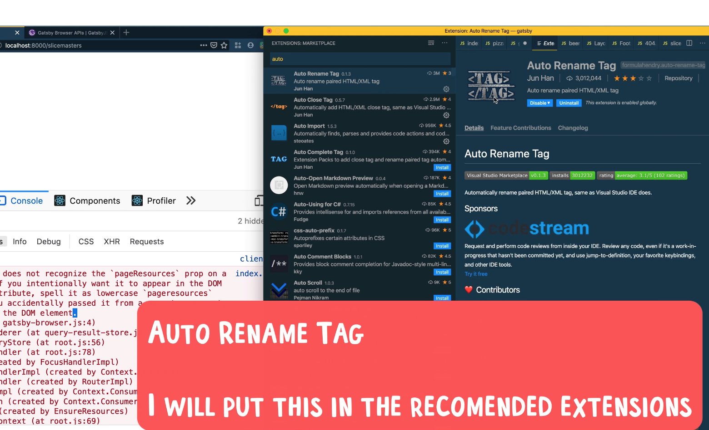

# VSCode FAQ

Q: How can I set a custom Emmet expand keyboard shortcut?

A: In VS Code, you can go to File -> Preferences -> Keyboard Shortcuts (Windows, Linux) or Code -> Preferences -> Keyboard Shortcuts (Mac). Search for Emmet Expand Abbreviation and you should see the current keyboard shortcut there. Double-click on the current key-bind to set a new keyboard shortcut. I have mine set to Ctrl + E which I really like but you can pick any combo you like!

Q: How do I set PATH on Mac so I can run VSCode in terminal

Q: How to change a TAG and have closing tag change as well

A: VSCode extension

