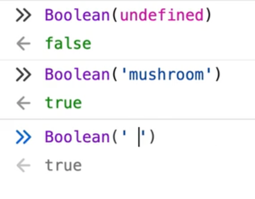

# Wes Bos - Hot Tips

## Objects

### Object.Values with Array.Filter(BOOLEAN)

Return an array of values that exist (no falsy object value)

```javascript
prepare: ({ title, media, ...toppings }) => {
      // 1. filter undefined toppings out
      const tops = Object.values(toppings).filter(Boolean);
      // 2. return the preview object for the pizza
      return {
        title,
        media,
        subtitle: tops.join(', '),
      };
    },
```




