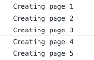

# Wes Bos - Hot Tips

## Objects

### Object.Values with Array.Filter(BOOLEAN)

Return an array of values that exist (no falsy object value)

```javascript
prepare: ({ title, media, ...toppings }) => {
      // 1. filter undefined toppings out
      const tops = Object.values(toppings).filter(Boolean);
      // 2. return the preview object for the pizza
      return {
        title,
        media,
        subtitle: tops.join(', '),
      };
    },
```


### Gatsby-node

Q. Why not just pass the entire Pizza Object via Context and avoid the Query on the SinglePizzaPage?

A. That is perfectly valid... however... because all the SinglePizzaPages work the same... it is sometimes easier to have the Query directly in this code in case modifications or even just a quick check of something in the query is needed. Another benefit is that as soon as you make a change to the Query in SinglePizzaPage, it is automatically updated in the React-Dev-Tools. Another related advantage is that if you wrote your entire Query in Gatsby-Node you would have to kill the process each time you made a Query Update.
... again - not a hard and fast rule - personal preference

### Loop from 1 to n and do something for each

Create an **Array** of a **size** by using `Array.from()` and passing in an **Object** with a **length** property. This creates an array with length equal to the length property. For example: if we have a `{length: 5}` we get the following result.

```javascript
console.log(Array.from({ length: 5 }));
```


**Note**: the length value can come from anywhere (hard-coded, passed into function, set as variable, come from node environment variable, etc)

We can then loop over the **Array** we just created with `.forEach()`. Since the array has all elements set to **undefined** we can ignore it (often times devs use an `_` when ignoring a value). It is the **index** value that we are interested in. Therefore, the **arrow function** we pass to `.forEach()` contains `_` as a placeholder since the it is the second value passed that contains the **index** (the third and final valuse is the array itself which is usually not needed but is available just in case).

```javascript
console.log(
  Array.from({ length: 5 }).forEach((_, index) => {
    console.log(`Creating page ${index + 1}`);
  })
);
```



another example...

```javascript
const pageCount = 4;

Array.from({ length: pageCount }).forEach((_, idx) => {
  console.log(idx + 1);
});
```
